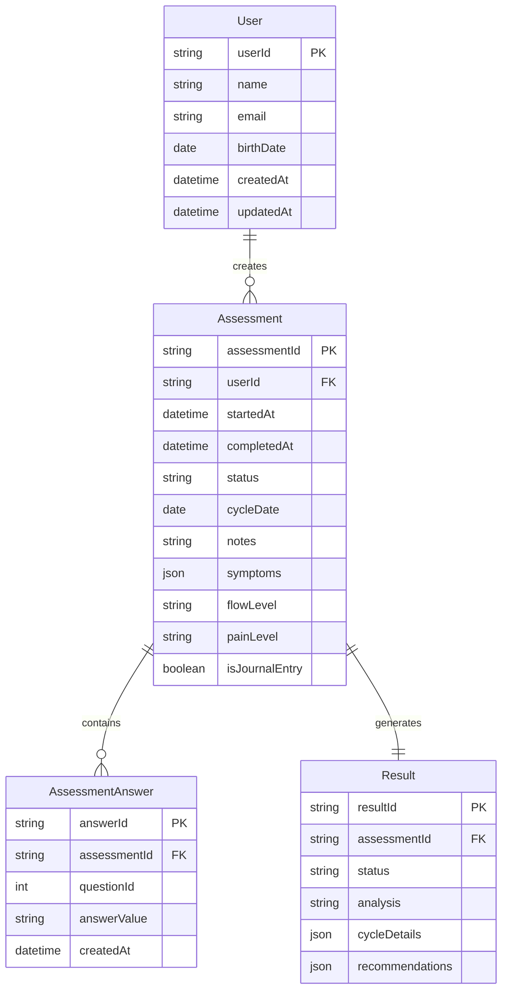

# Entity-Relationship Diagram (ERD) for Dottie

## Overview

This document outlines the database structure for the Dottie Menstrual Health Assessment application. This simplified structure is designed for an MVP implementation by junior developers.

## Entities and Relationships

### Entity Diagram



## Entity Descriptions

### User
- **userId**: Unique identifier for the user
- **name**: User's name
- **email**: User's email address (for account management)
- **createdAt**: When the user account was created

### Assessment
- **assessmentId**: Unique identifier for each assessment
- **userId**: Reference to the user taking the assessment
- **startedAt**: Timestamp when assessment was started
- **completedAt**: Timestamp when assessment was completed
- **status**: Current status of the assessment (in_progress, completed)
- **cycleDate**: Date this assessment/journal entry refers to
- **notes**: User's notes for journal entries
- **symptoms**: Array of symptoms experienced (stored as JSON)
- **flowLevel**: Level of menstrual flow
- **painLevel**: Level of pain experienced
- **isJournalEntry**: Boolean flag to distinguish between formal assessments and simple journal entries

### AssessmentAnswer
- **answerId**: Unique identifier for each answer
- **assessmentId**: Reference to the assessment
- **questionId**: Reference to the question ID (static, not a foreign key)
- **answerValue**: The user's answer (may be stored as string or JSON depending on question type)
- **createdAt**: When the answer was submitted

### Result
- **resultId**: Unique identifier for each result
- **assessmentId**: Reference to the completed assessment
- **status**: Overall health status category from logic tree (e.g., "Developing Normally")
- **analysis**: Textual analysis of the user's cycle health
- **cycleDetails**: JSON storing cycle specifics (length, duration, symptoms, etc.)
- **recommendations**: Array of recommendations (stored as JSON) including title, description and category

## Relationships

1. **User to Assessment**: One-to-Many (A user can have multiple assessments/journal entries)
2. **Assessment to AssessmentAnswer**: One-to-Many (An assessment has multiple answers)
3. **Assessment to Result**: One-to-One (Each completed assessment has one result)

## Static Data (Not in Database)

### Questions
The question data will be stored as static content in the application code rather than in the database:

```javascript
const questions = [
  {
    id: 1,
    text: "What is your age group?",
    orderNumber: 1,
    questionType: "single_choice",
    options: ["under_12", "12_14", "15_17", "18_24", "over_24"]
  },
  {
    id: 2,
    text: "What is your menstrual cycle length?",
    orderNumber: 2,
    questionType: "single_choice",
    options: ["less_than_21", "21_25", "26_30", "31_35", "more_than_35", "irregular"]
  },
  // Other questions defined statically
]
```

## MVP Implementation Phases

### Phase 1 (Core MVP)
- User signup/login
- Basic assessment flow with static questions
- Simple results based on predefined logic
- Basic journal entry functionality

### Phase 2 (Enhanced Features)
- Medical journal reference comparison
- Improved analytics and visualizations
- Azure ML integration for personalized feedback

## Database Implementation Notes

This will use cosmos db in the AZure cloud. Locally, it will run on sqlite.
