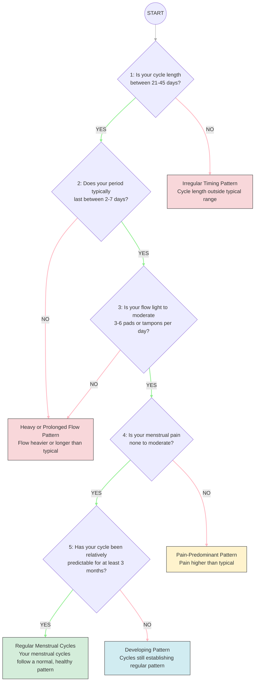

```mermaid
graph TD
    START((START)) --> Q1

    %% Questions - using diamond shape for decision points
    Q1{1: Is your cycle length<br>between 21-45 days?} -->|YES| Q2
    Q1 -->|NO| O1
    
    Q2{2: Does your period typically<br>last between 2-7 days?} -->|YES| Q3
    Q2 -->|NO| O2
    
    Q3{3: Is your flow light to moderate<br>3-6 pads or tampons per day?} -->|YES| Q4
    Q3 -->|NO| O2
    
    Q4{4: Is your menstrual pain<br>none to moderate?} -->|YES| Q5
    Q4 -->|NO| O3
    
    Q5{5: Has your cycle been relatively<br>predictable for at least 3 months?} -->|YES| O4
    Q5 -->|NO| O5
    
    %% Outcomes
    O1[Irregular Timing Pattern<br>Cycle length outside typical range]:::irregular
    
    O2[Heavy or Prolonged Flow Pattern<br>Flow heavier or longer than typical]:::heavy
    
    O3[Pain-Predominant Pattern<br>Pain higher than typical]:::pain
    
    O4[Regular Menstrual Cycles<br>Your menstrual cycles follow a normal, healthy pattern]:::regular
    
    O5[Developing Pattern<br>Cycles still establishing regular pattern]:::developing
    
    
    %% Style classes
    classDef irregular fill:#f8d7da,stroke:#333,stroke-width:1px
    classDef heavy fill:#f8d7da,stroke:#333,stroke-width:1px
    classDef pain fill:#fff3cd,stroke:#333,stroke-width:1px
    classDef developing fill:#d1ecf1,stroke:#333,stroke-width:1px
    classDef regular fill:#d4edda,stroke:#333,stroke-width:1px
    classDef disclaimer fill:#fff3cd,stroke:#333,stroke-width:1px
    
    %% Link styling
    linkStyle 0 stroke:#aaaaaa,stroke-width:1px
    linkStyle 1 stroke:#90EE90,stroke-width:2px
    linkStyle 2 stroke:#FFB6C1,stroke-width:2px
    linkStyle 3 stroke:#90EE90,stroke-width:2px
    linkStyle 4 stroke:#FFB6C1,stroke-width:2px
    linkStyle 5 stroke:#90EE90,stroke-width:2px
    linkStyle 6 stroke:#FFB6C1,stroke-width:2px
    linkStyle 7 stroke:#90EE90,stroke-width:2px
    linkStyle 8 stroke:#FFB6C1,stroke-width:2px
    linkStyle 9 stroke:#90EE90,stroke-width:2px
    linkStyle 10 stroke:#FFB6C1,stroke-width:2px
```