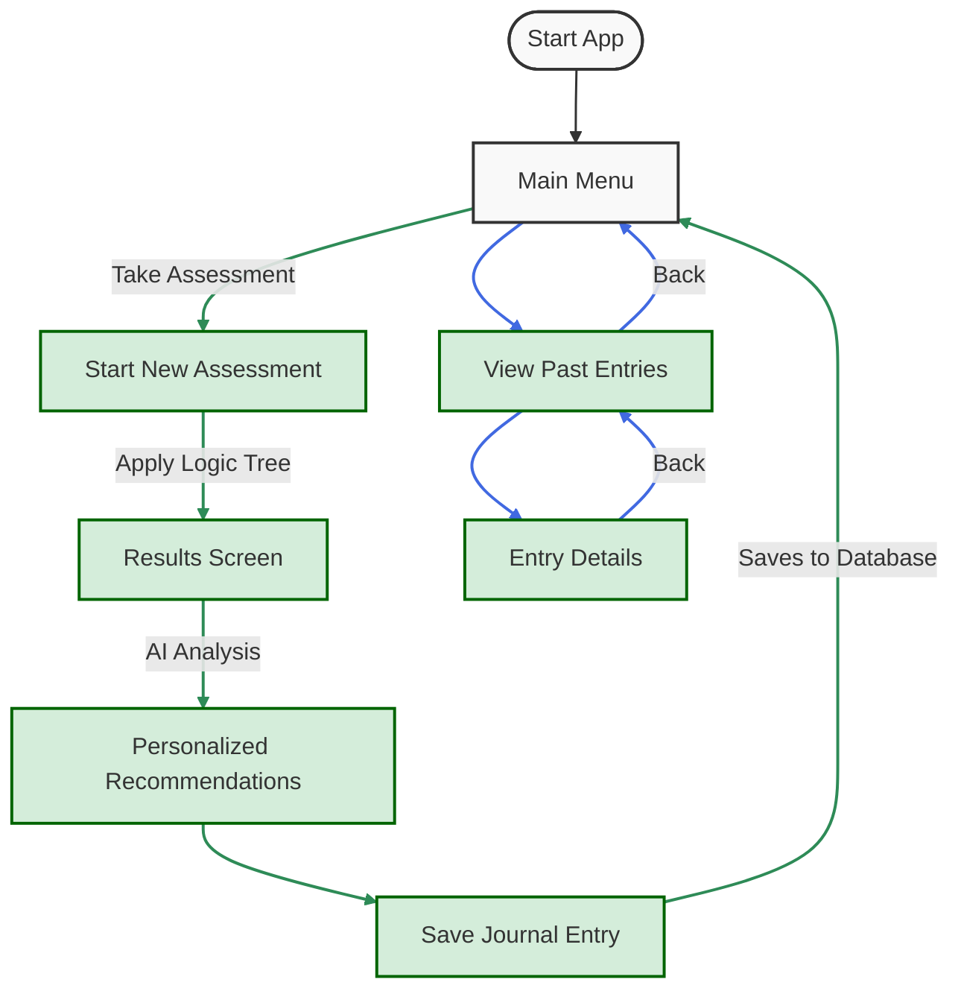

# User Journey for Dottie App

This document outlines the main user flows within the Dottie application.

## User Journey Flowchart

## Path Descriptions

### Path 1: Take Assessment

1. User opens the app and arrives at the Main Menu
2. User selects "Take Assessment"
3. User progresses through 6 assessment questions:
   - Question 1: Age group
   - Question 2: Menstrual cycle length
   - Question 3: Period duration
   - Question 4: Flow heaviness
   - Question 5: Pain level
   - Question 6: Physical and emotional symptoms
4. System processes answers using the Logic Tree
5. User receives personalized results and analysis
6. AI generates personalized recommendations
7. Assessment is automatically saved as a journal entry
8. User returns to the Main Menu

### Path 2: View Past Entries

1. User opens the app and arrives at the Main Menu
2. User selects "View Past Entries"
3. User browses through previously saved entries (assessments)
4. User can select an entry to view full details, including analysis and recommendations
5. User can navigate back to the entries list or to the Main Menu

## Integration Points

- **Assessment Logic Tree**: Used during the assessment flow to analyze responses and determine results
- **AI Analysis Engine**: Processes assessment data to generate personalized recommendations
- **Journal Database**: Stores all assessments as journal entries

## User Experience Notes

- The assessment flow is designed to be simple and progressive, with one question at a time
- Past entries provide valuable tracking data to help users monitor their menstrual health over time 