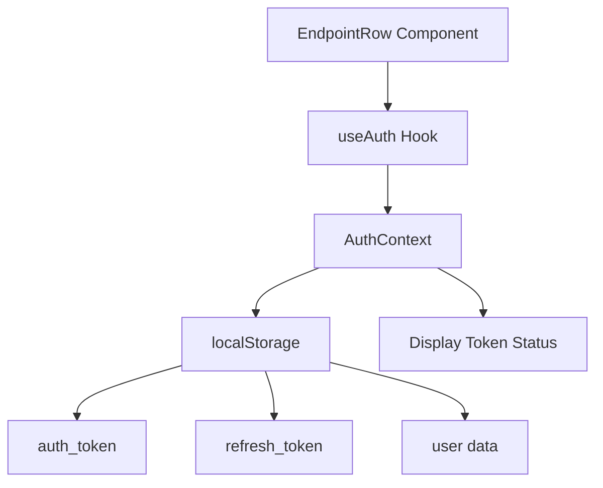
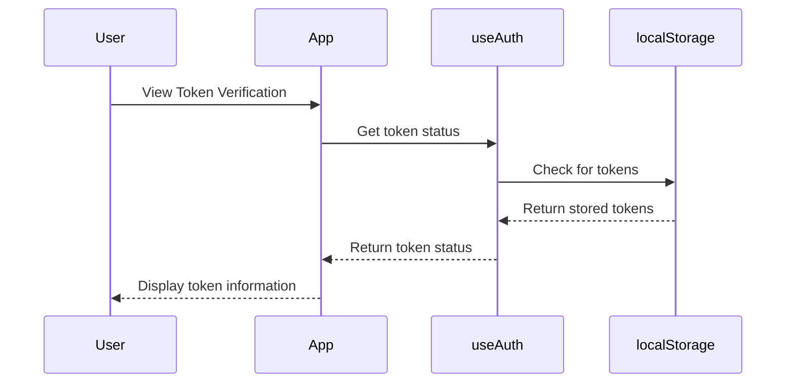

# Token Verification Component

This component demonstrates how the `useAuth` hook checks for authentication tokens in the application.

## Overview

The Token Verification component is a **frontend-only operation** that:

1. Uses the `useAuth` hook to access token information from React Context
2. Displays the current token status from localStorage
3. Does NOT make actual API requests to a backend

## How It Works



## File Structure

```
dottie-app/
├── src/
│   ├── hooks/
│   │   ├── use-auth.tsx        # Main auth hook with Context Provider
│   │   └── README.md           # Documentation for hooks
│   └── test_page/
│       └── test-endpoint-table/
│           └── auth/
│               └── get-verify-authtoken/
│                   ├── EndpointRow.tsx   # This component
│                   └── README.md         # This documentation
```

## Usage

This component is used in the test page to demonstrate and verify that:

1. Authentication tokens are properly stored in localStorage
2. The `useAuth` hook correctly retrieves and exposes these tokens
3. The authentication context is properly initialized and accessible

## Test Expectations

When using this component:

- If no tokens exist, it will show `authTokenExists: false` and `refreshTokenExists: false`
- If tokens exist, it will show the first 10 characters of each token followed by `...`
- This helps developers verify that the authentication system is working correctly

## Relationship to Auth System

The component doesn't make API requests but demonstrates the client-side portion of the authentication flow:



## Related Files

- `src/hooks/use-auth.tsx`: The main authentication hook that provides context
- `src/api/auth/requests/postLogin/Request.ts`: Handles the actual login API request 